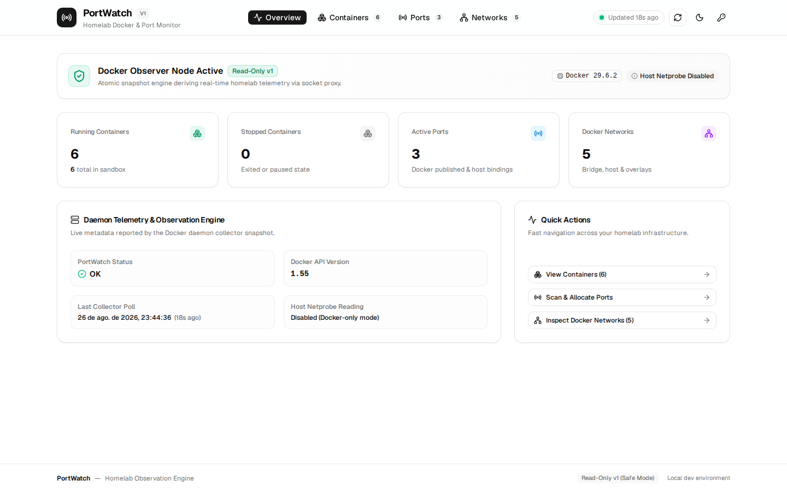
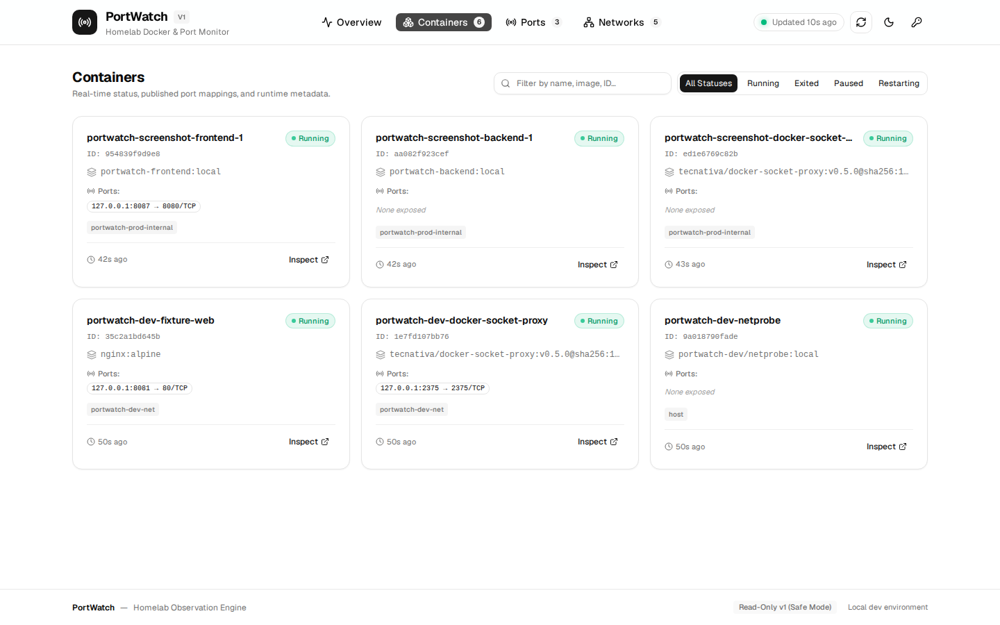
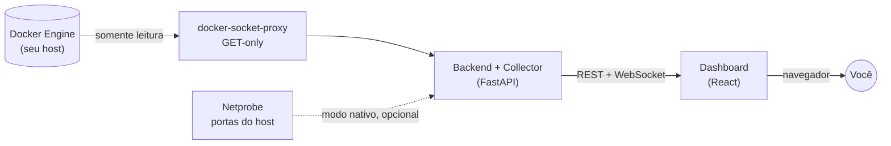

# PortWatch

[](https://github.com/DeathHapyness/PortWatch/actions/workflows/ci.yml)
[](LICENSE)
[](infra/prod/README.md)

**Painel de monitoramento pro seu homelab: containers, redes e portas —
tudo em tempo real, sem instalar nada além do Docker.**

Nada de ficar rodando `docker ps` toda hora pra lembrar o que tá de pé, ou
tentando adivinhar qual porta já tá ocupada antes de subir mais um serviço.
PortWatch descobre seus containers, redes e portas publicadas sozinho e
mostra tudo num dashboard que atualiza ao vivo — 100% somente leitura, nunca
inicia, para ou mexe em nada que você esteja rodando.

```sh
git clone https://github.com/DeathHapyness/PortWatch.git
cd PortWatch
docker compose up -d --build
docker compose logs backend | grep PORTWATCH_API_TOKEN=
```

Abre `http://127.0.0.1:8087`, cola o token (ícone de chave no header) e
pronto — sem configurar nada antes. Deu erro, ou quer acessar de outra
máquina na sua rede? [`infra/prod/README.md`](infra/prod/README.md#problemas-comuns)
tem os problemas mais comuns resolvidos passo a passo.

<p align="center">
  
  
</p>

## Por que

Homelab cresce rápido — dez containers viram trinta, três redes viram
oito, e "essa porta tá livre?" vira uma pergunta que ninguém responde de
cabeça. PortWatch existe pra isso:

- 🔍 **Descoberta automática** — containers, redes Docker e portas
  publicadas, sem precisar cadastrar nada manualmente.
- 🔌 **Portas publicadas dos seus containers** — sabe o que já tá em uso
  antes de subir o próximo serviço (visibilidade de portas ocupadas do host
  inteiro, não só as publicadas, é opcional — ver "Status" abaixo).
- ⚡ **Tempo real** — WebSocket empurra atualização assim que algo muda no
  Docker; volta pra polling sozinho se a conexão cair.
- 👀 **Somente leitura, sempre** — nenhum endpoint da API inicia, para,
  reinicia ou executa comando em qualquer container. PortWatch olha, não
  mexe.
- 🔒 **Acesso ao Docker isolado** — a aplicação nunca monta
  `/var/run/docker.sock` diretamente; fala só com um proxy GET-only
  dedicado.
- 🐳 **Um `docker compose up` e pronto** — imagens non-root, hardened,
  token gerado sozinho na primeira subida.

## Como funciona



O Collector varre containers/redes/portas periodicamente, guarda um
snapshot atômico em memória (sem banco de dados, sem persistência — o
estado é sempre derivado ao vivo do Docker) e expõe tudo via API REST +
WebSocket. O dashboard consome isso e atualiza sozinho.

## Início rápido

```sh
git clone https://github.com/DeathHapyness/PortWatch.git
cd PortWatch
docker compose up -d --build
```

Sem `PORTWATCH_API_TOKEN` definido, o backend gera um token aleatório na
primeira subida e imprime nos logs:

```sh
docker compose logs backend | grep PORTWATCH_API_TOKEN=
```

Cola esse token no dashboard (`http://127.0.0.1:8087`, ícone de chave no
header) e é isso — nenhum passo de configuração antes de ver o painel
funcionando. Detalhes de como acessar de outra máquina, trocar a porta, ou
o que fica de fora dessa topologia (Netprobe, TLS) em
[`infra/prod/README.md`](infra/prod/README.md).

## Documentação

| | |
|---|---|
| [`docs/README.md`](docs/README.md) | índice de toda a documentação |
| [`docs/reference/configuration.md`](docs/reference/configuration.md) | toda variável de ambiente, defaults e limites |
| [`docs/security/threat-model.md`](docs/security/threat-model.md) | ativos, fronteiras de confiança e riscos residuais |
| [`docs/security/operator-guide.md`](docs/security/operator-guide.md) | requisitos mínimos pra uma implantação segura |
| [`docs/release/public-release-checklist.md`](docs/release/public-release-checklist.md) | o que falta antes de chamar isto de "pronto pra qualquer um" |
| [`docs/adr/`](docs/adr/) | decisões de arquitetura, com o porquê de cada uma |
| Arquitetura completa | https://claude.ai/code/artifact/b41be8c8-2963-4ef8-a4f7-b984b68407a8 |

## Status

Funcional hoje para uso pessoal em homelab — containers, redes, portas
publicadas e dashboard ao vivo, tudo testado ponta a ponta (local e em CI
real). Visibilidade de **portas ocupadas do host** (Netprobe) só funciona
rodando o backend nativamente, não na topologia 100% containerizada — é
física de rede, não uma limitação arbitrária, ver
[`infra/prod/README.md`](infra/prod/README.md). O que falta pra um release
público "sem ressalvas" (scan de imagens em CI, branch protection, TLS
documentado com receita pronta) está rastreado, item por item, em
[`docs/release/public-release-checklist.md`](docs/release/public-release-checklist.md).

## Licença

[MIT](LICENSE) — use, modifique, redistribua à vontade.

## Desenvolvimento

<details>
<summary>Requisitos, sandbox de dev e rodando localmente</summary>

### Requisitos

- Node 22 LTS (via `nvm`, ver `.nvmrc`)
- pnpm (via `corepack`, já habilitado pelo Node)
- Python 3.12 + [`uv`](https://docs.astral.sh/uv/)
- Docker + Docker Compose (contexto **local**, nunca o do homelab de produção)

### Sandbox de desenvolvimento

Todo o desenvolvimento e teste roda contra um Docker isolado nesta máquina —
nunca contra o Docker de produção do homelab (ver `CLAUDE.md`).

```sh
make dev-up      # sobe o sandbox (com verificação de segurança prévia)
make dev-status  # lista o que está rodando no sandbox
make dev-down    # derruba e limpa o sandbox
```

`infra/dev/guard.sh` recusa subir a stack se o Docker "de destino" não parecer
ser um Docker de desenvolvimento local vazio — ver comentários no script.

Além do fixture inerte (`fixture-web`), o sandbox inclui os dois serviços usados
pelo Collector, ambos publicados só em `127.0.0.1` para o backend nativo
(rodando fora do Docker) alcançar:

- `docker-socket-proxy` (`127.0.0.1:2375`) — único container com o socket
  Docker real montado, restrito a GET (ver
  `docs/adr/0003-docker-access-isolation.md`).
- `netprobe` (`127.0.0.1:8088`) — utilitário mínimo que lê `/proc/net/*` do
  host para reportar portas ocupadas; único componente com
  `network_mode: host`, sem nenhum acesso ao socket Docker. Contrato HTTP em
  `infra/netprobe/README.md`.

### Rodando localmente

```sh
# Backend — http://127.0.0.1:8000, docs em /docs, contrato em /openapi.json
cd apps/backend
# Se o sandbox de dev estiver de pé (make dev-up), aponte para os serviços
# de infra via loopback (fora disso, os defaults deixam os recursos
# desabilitados — ver core/config.py):
export PORTWATCH_DOCKER_PROXY_URL=http://127.0.0.1:2375
export PORTWATCH_NETPROBE_URL=http://127.0.0.1:8088
uv run uvicorn portwatch_backend.app:app --reload --port 8000
# Referência completa de todas as variáveis, defaults e limites:
# docs/reference/configuration.md

# Frontend — http://127.0.0.1:5173, proxy /api/* -> backend acima
# (proxy inclui upgrade de WebSocket para /api/v1/events)
cd apps/web
pnpm install
pnpm dev
```

Se o backend tiver um token configurado (`PORTWATCH_API_TOKEN`), digite-o
no dashboard: ícone de chave no header → cola o token → salva (recarrega a
página). Ele fica só em `localStorage` deste navegador, nunca no bundle
JS. `VITE_API_TOKEN` (env var no build) continua funcionando como atalho
de conveniência para desenvolvimento local, mas não é mais necessário nem
recomendado.

### Checagens de qualidade

```sh
cd apps/backend && uv run ruff check . && uv run ruff format --check . && uv run mypy src && uv run pytest
cd apps/web     && pnpm run lint && pnpm run format:check && pnpm run test && pnpm run build
python -m unittest discover -s infra/netprobe/tests -v   # mudanças em infra/netprobe
```

`uv run pytest` acima nunca toca Docker (exclui o marker `e2e` por padrão —
ver `pyproject.toml`). Para rodar a suíte E2E de verdade contra o sandbox
real (sobe/derruba a stack sozinha, mesmo guard do `make dev-up`):

```sh
make test-e2e
```

Para construir e validar a imagem de produção do backend localmente
(Docker local, nunca o homelab):

```sh
cd apps/backend && docker build -t portwatch-backend .
docker run --rm -p 8000:8000 -e PORTWATCH_API_TOKEN=<algo> portwatch-backend
curl http://127.0.0.1:8000/health
```

### Estrutura

```
apps/backend/   FastAPI + Collector (mesmo processo, ver ADR-0001), uv, Dockerfile de produção
apps/web/       React + TypeScript + Vite + Tailwind + shadcn/ui, Dockerfile de produção
docs/adr/       Architecture Decision Records
docs/security/  modelo de ameaça e guia de implantação segura
docs/release/   checklist de release público
infra/dev/      sandbox Docker isolado para desenvolvimento
infra/prod/     Compose de produção (backend + frontend + docker-socket-proxy)
infra/netprobe/ utilitário host-only de portas ocupadas
```

### Detalhes técnicos

O Collector coleta containers, redes e portas do sandbox via
`docker-socket-proxy`/`netprobe`, publica snapshots atômicos em memória
(índice O(1) para lookup por id/nome e uma visão-resumo pré-computada,
`SnapshotOverview`, para `/health/ready` e `/api/v1/system/summary`) e
expõe readiness real. Todas as rotas leem esses snapshots — nenhuma retorna
dados de exemplo. Nem o Docker nem o netprobe são confiados às cegas: as
respostas de ambos são validadas por shape antes de virar estado interno, e
o cliente do netprobe usa `httpx.stream` para abortar uma resposta acima de
1 MiB durante a transferência, não depois de já ter baixado tudo. Um ciclo
do Collector tem orçamento de tempo e limites de contagem configuráveis
(ADR-0007); estourar qualquer um falha o ciclo sem publicar um snapshot
truncado. Autenticação por token estático (ADR-0004); erros no contrato RFC
7807 completo; labels/env de containers redigidos por padrão. Respostas de
`/api/v1/*` e `/metrics` levam `Cache-Control: no-store`; todo response leva
`X-Content-Type-Options: nosniff` e `X-Frame-Options: DENY`.

`/api/v1/events` transmite invalidações de snapshot em tempo real via
WebSocket, com desligamento gracioso, limite de conexões simultâneas e
autenticação tanto por header quanto por primeira mensagem (clientes
não-browser) — ver `docs/adr/0006-websocket-first-message-auth.md`. O
dashboard consome REST + esse WebSocket via TanStack Query, com polling
como fallback se a conexão cair. Testes E2E (`apps/backend/tests/e2e/`,
`make test-e2e`) sobem o sandbox real e validam o Collector fim a fim.
Observabilidade: métricas Prometheus em `GET /metrics` e logs estruturados
em JSON com `request_id` correlacionado por requisição.

</details>
